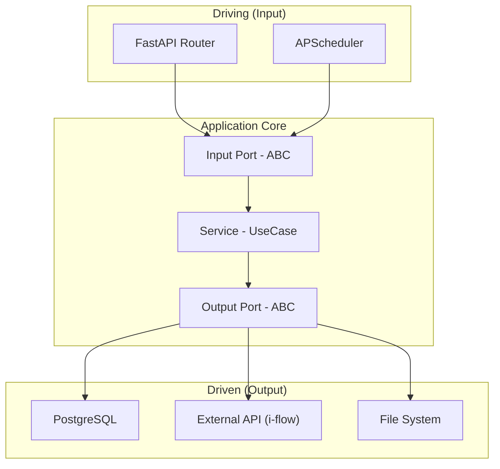
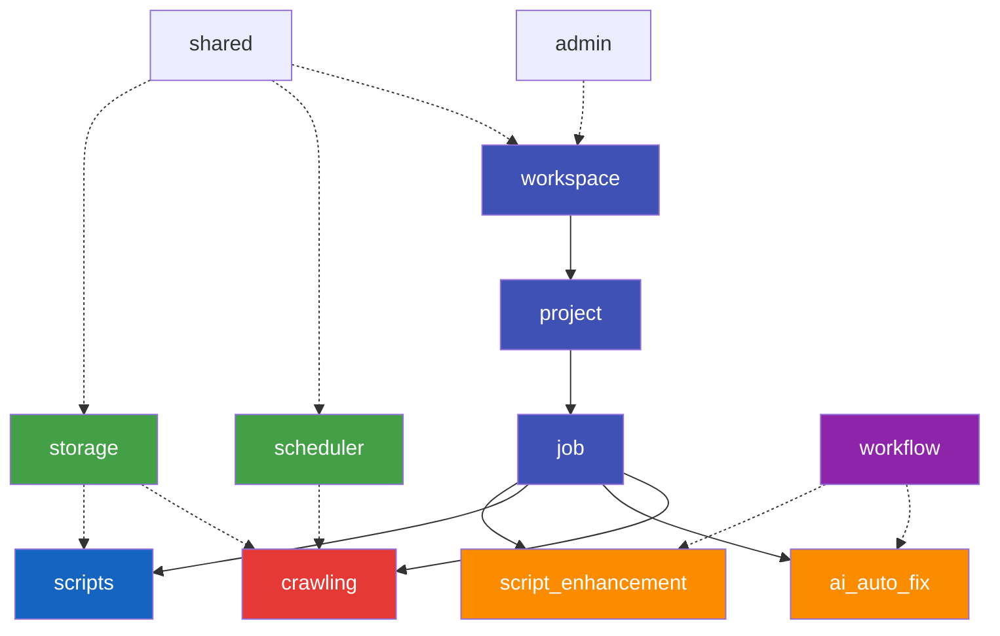
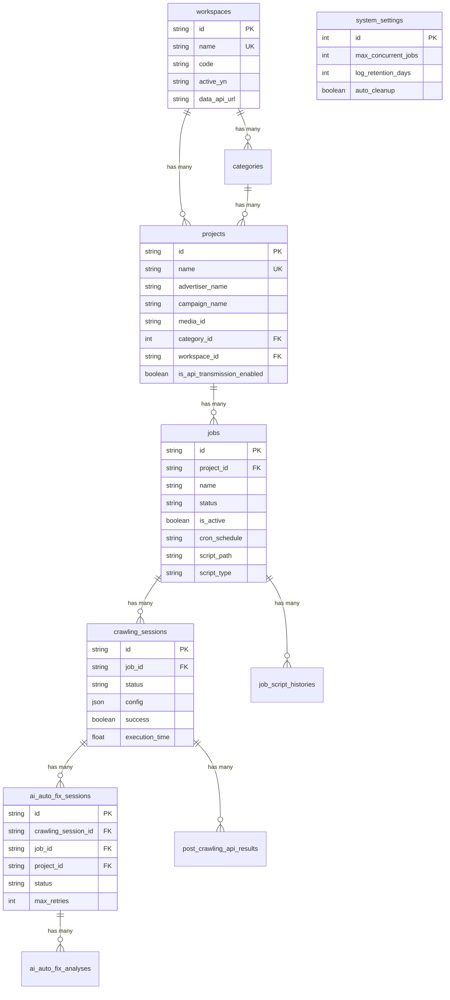
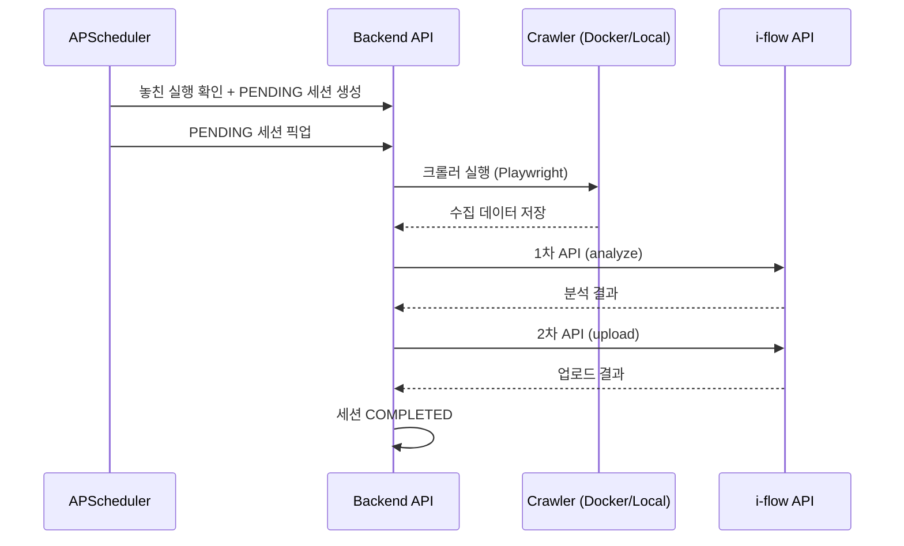
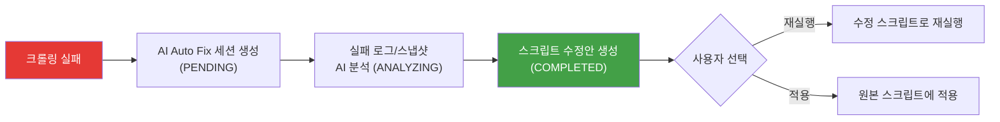
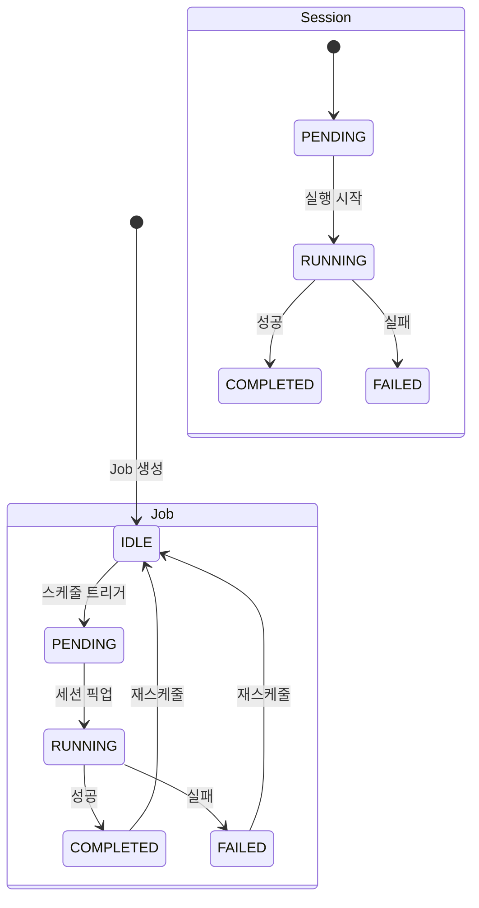

# 백엔드 — 아키텍처 및 설계

---

## 1. 헥사고날 아키텍처

모든 도메인은 **Ports & Adapters (Hexagonal) Architecture**를 따릅니다.



```
{domain}/
├── adapter/input/controllers/    → Driving Adapter (FastAPI Router)
├── adapter/output/repositories/  → Driven Adapter (DB)
├── adapter/output/external/      → Driven Adapter (외부 API)
├── application/service/          → 비즈니스 로직 (UseCase 구현)
├── domain/entities/              → 도메인 엔티티 / ORM 모델
├── domain/ports/in_/             → Input Port (UseCase 인터페이스, ABC)
└── domain/ports/out_/            → Output Port (Repository/External 인터페이스)
```

---

## 2. 도메인 구조



```
backend/
├── workspace/                       # 워크스페이스 도메인
│   └── project/                     # 프로젝트 서브 도메인
│       └── job/                     # Job 서브 도메인
│           ├── crawling/            # 크롤링 실행/세션
│           ├── ai_auto_fix/         # AI 자동 수정
│           ├── scripts/             # 스크립트 관리
│           └── script_enhancement/  # 스크립트 개선
├── scheduler/                       # 스케줄링 도메인 (수동 DI)
├── storage/                         # 파일 시스템 추상화
├── workflow/                        # 워크플로우 엔진
├── admin/                           # 시스템 설정/알림
└── shared/                          # 공통 모듈 (DB, Config, Routes, Scheduler)
```

---

## 3. DI 패턴

| 패턴 | 대상 | 방식 |
|------|------|------|
| **FastAPI Depends** | API 서비스 | `Depends(Adapter)` — HTTP 요청 라이프사이클 |
| **수동 DI** | 배치/스케줄러 | Runner 함수에서 `AsyncSession` 직접 주입 |
| **Borg 싱글턴** | Adapter/Service | `__dict__` 공유 (DB 세션 제외) |

---

## 4. ERD

### 4.1 테이블 관계도



### 4.2 주요 테이블

| 테이블 | 설명 |
|--------|------|
| `workspaces` | 최상위 조직 단위. `data_api_url`로 후처리 API 결정 |
| `projects` | 크롤링 프로젝트. 광고주/캠페인/매체 정보 |
| `jobs` | 프로젝트당 크롤링 작업. Cron 스케줄, 스크립트 경로 |
| `crawling_sessions` | Job 실행 이력. PENDING → RUNNING → COMPLETED/FAILED |
| `ai_auto_fix_sessions` | 크롤링 실패 시 AI 자동 수정 세션 |
| `post_crawling_api_results` | 1차(analyze)/2차(upload) API 호출 결과 |
| `options` | 동적 설정 (AI 프롬프트 등) |

---

## 5. API 명세

### 5.1 API 문서

- **Swagger UI**: `http://<HOST>:<PORT>/docs`
- **ReDoc**: `http://<HOST>:<PORT>/redoc`

### 5.2 주요 엔드포인트

| 태그 | Prefix | 주요 기능 |
|------|--------|----------|
| `projects` | `/api/v1` | 프로젝트 CRUD, 배치 업데이트, 필터 조회 |
| `categories` | `/api/v1` | 카테고리 CRUD |
| `jobs` | `/api/v1` | Job CRUD, 스케줄 관리 |
| `crawling` | `/api/v1` | 크롤링 실행/중지, 세션 조회, 로그 조회 |
| `ai-auto-fix` | `/api/v1` | AI Auto Fix 시작/상태/취소, 스크립트 적용 |
| `admin` | `/api/v1/admin` | 시스템 설정, 알림, 옵션, Docker 정리 |
| `workspaces` | `/api/v1` | 워크스페이스 CRUD |
| `enhanced-scripts` | `/api/v1` | 스크립트 개선 트리거/미리보기/적용 |

---

## 6. 핵심 로직

### 6.1 크롤링 실행 흐름



### 6.2 AI Auto Fix



### 6.3 상태 전이



### 6.4 후처리 API (Incross i-flow)

| 단계 | API | 설명 |
|------|-----|------|
| 1차 | `analyze` | CSV 파일 분석 (컬럼 매핑, 유효성 검증) |
| 2차 | `upload` | 분석 완료된 데이터 업로드 |

- `is_api_transmission_enabled = true` 프로젝트만 대상
- Workspace `data_api_url` 없으면 스킵
