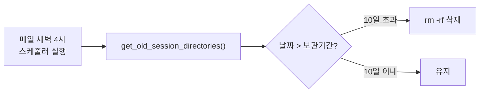

# 로그 자동 정리 검증 체크리스트

> 작성일: 2026-03-17 13:22 KST
> 예정일: 2026-03-18 04:00 KST (스케줄러 자동 실행)
> 상태: ⏳ **자동 정리 실행 대기 중** — 아래 검증 결과가 모두 체크되면 완료 처리

---

## 배경



`get_old_session_directories()`에서 경로 불일치 버그를 수정함 (`base_path/RESULTS_DIR` → `results_base_path`).
이전까지 자동 정리가 작동하지 않아 2월 데이터까지 남아있었음.

**배포 시점**: 2026-03-17 10:47 KST
**보관 기간**: 10일 (`auto_cleanup = true`)
**삭제 기준일**: 2026-03-08 (3/18 새벽 4시 기준)

---

## 정리 전 상태 (2026-03-17 13:20 기준)

### 전체 디스크

| 항목 | 값 |
|---|---|
| 전체 workspace 데이터 | **67.5GB** |
| Legacy `crawling_results/` | 비어있음 (0) |

### 날짜별 상세 (workspace 구조)

| 날짜 | 용량 | 디렉토리 수 | 삭제 여부 |
|---|---|---|---|
| 20260218 | 2.48GB | 8 | ✅ 삭제 |
| 20260219 | 5.55GB | 8 | ✅ 삭제 |
| 20260220 | 4.64GB | 11 | ✅ 삭제 |
| 20260221 | 2.44GB | 9 | ✅ 삭제 |
| 20260222 | 1.28GB | 9 | ✅ 삭제 |
| 20260223 | 3.53GB | 11 | ✅ 삭제 |
| 20260224 | 1.27GB | 10 | ✅ 삭제 |
| 20260225 | 1.27GB | 9 | ✅ 삭제 |
| 20260226 | 2.47GB | 9 | ✅ 삭제 |
| 20260227 | 3.70GB | 9 | ✅ 삭제 |
| 20260228 | 1.29GB | 9 | ✅ 삭제 |
| 20260301 | 1.28GB | 9 | ✅ 삭제 |
| 20260302 | 1.29GB | 10 | ✅ 삭제 |
| 20260303 | 1.29GB | 9 | ✅ 삭제 |
| 20260304 | 1.30GB | 9 | ✅ 삭제 |
| 20260305 | 1.31GB | 10 | ✅ 삭제 |
| 20260306 | 1.32GB | 10 | ✅ 삭제 |
| 20260307 | 1.27GB | 10 | ✅ 삭제 |
| 20260308 | 1.30GB | 10 | ⏳ 유지 (경계) |
| 20260309 | 1.30GB | 11 | ⏳ 유지 |
| 20260310 | 1.31GB | 12 | ⏳ 유지 |
| 20260311 | 1.26GB | 12 | ⏳ 유지 |
| 20260312 | 1.29GB | 12 | ⏳ 유지 |
| 20260313 | 3.75GB | 12 | ⏳ 유지 |
| 20260314 | 4.07GB | 12 | ⏳ 유지 |
| 20260315 | 3.89GB | 12 | ⏳ 유지 |
| 20260316 | 0.31GB | 15 | ⏳ 유지 |
| 20260317 | 10.01GB | 14 | ⏳ 유지 |

### 예상 결과

| 항목 | 값 |
|---|---|
| 삭제 대상 | 20260218 ~ 20260307 (20일분) |
| 삭제 예상 용량 | **~37.7GB** |
| 삭제 디렉토리 수 | ~159개 |
| 정리 후 남는 용량 | **~29.8GB** |

---

## 정리 후 검증 방법

### 1. 백엔드 로그 확인
```bash
# 운영서버 접속 후
docker logs vibe-crawler-backend 2>&1 | grep -i "로그 정리"
```

출력에 아래와 같은 내용이 있어야 함:
```
로그 정리 완료 - 디렉토리: 20개, 파일: XXX개, 크기: XXXMB
```

### 2. 디스크 용량 확인
```bash
# 운영서버에서 실행
du -sh ~/vibe-deployment/system_storage/workspaces/*/projects/*/sessions/* 2>/dev/null | sort -t/ -k11
```

- 20260218 ~ 20260307 폴더가 **존재하지 않아야** 함
- 20260308 이후 폴더만 남아있어야 함

### 3. 디스크 여유 공간 확인
```bash
df -h /
```

- 정리 전 100% 사용 → 정리 후 **약 37GB 확보** 예상

---

## 검증 결과 (정리 후 기록)

> ⚠️ 서버 재배포(또는 스케줄링 타이밍) 이슈로 인해 3월 18일 오전 기준 아직 자동 삭제가 수행되지 않았습니다.

- [ ] 백엔드 로그에 "로그 정리 완료" 메시지 확인 (컨테이너 재시작으로 로그 확인 안됨)
- [ ] 20260307 이전 폴더 삭제 확인 (20260218 ~ 20260307 폴더 여전히 존재)
- [ ] `df -h /` 디스크 여유 공간 확보 확인 (현재 38GB 여유, 정리 전 수동삭제로 확보한 용량 유지 중)
- [x] 확인 날짜/시간: 2026-03-18 09:48 KST
- [ ] 실제 삭제 용량: 미실행
- [ ] 정리 후 디스크 사용률: 61% (58GB / 96GB)

---

## 수동 정리 기록 (2026-03-18)

### 1차. 프로젝트 `3c042a40` 선행 정리 (2026-03-17 13:25 KST)
- 삭제 범위: `20260218 ~ 20260307` (18개 날짜 폴더)
- 삭제 용량: **~37GB**
- 디스크 사용률: 96GB/96GB (100%) → 47GB/96GB (49%)

### 2차. 3월 7일 이전 남은 폴더 수동 삭제 (2026-03-18 09:50 KST)
- 스케줄러 미작동으로 인해 남은 고아 폴더 강제 삭제
- 대상 폴더 수: **151개**
- 대상 용량: **2.9GB**
- `xargs rm -rf` 를 통해 삭제 완료

---

## 📅 내일(2026-03-19) 새벽 4시 검증 대상

내일이 되면 **20260308** 날짜 폴더가 10일을 초과하게 되어 삭제 대상이 됩니다.
스케줄러가 정상 작동한다면 아래 10개 폴더가 자동으로 삭제되어야 합니다.

**삭제 대상 폴더 목록 (총 10개, 약 1.3GB)**
| Workspace | Project | Folder | Size |
|---|---|---|---|
| `1111...` | `37703364` | `20260308` | 8.7M |
| `1111...` | `470f8afa` | `20260308` | 17M |
| `1111...` | `57650074` | `20260308` | 5.8M |
| `1111...` | `7803af8a` | `20260308` | 9.4M |
| `1111...` | `89e5483e` | `20260308` | 22M |
| `1111...` | `f7cad62f` | `20260308` | 9.6M |
| `1111...` | `fa7aaf1d` | `20260308` | 5.1M |
| `2222...` | `14143f81` | `20260308` | 5.8M |
| `2222...` | `3c042a40` | `20260308` | 1.2G |
| `2222...` | `e0b0a404` | `20260308` | 46M |

- [x] 19일 오전, 위 10개 폴더가 모두 삭제되었는지 확인 → ✅ 수동 삭제 완료 (아래 기록)
- [ ] 백엔드 로그에서 `로그 정리 완료` 메시지 유무 확인 → 코드 미배포로 확인 불가

---

## 수동 정리 기록 (2026-03-19)

### 3차. 20260308 폴더 수동 삭제 (2026-03-19 10:01 KST)
- 코드 수정은 아직 미배포 → 수동으로 정리 진행
- 대상 폴더 수: **10개** (20260308)
- 대상 용량: **~1.3GB**
- 디스크 사용률: 71% (68GB) → 70% (67GB)
- 명령: `find ... -name "20260308" | xargs rm -rf`

---

## 📅 내일(2026-03-20) 자동 정리 검증 대상

> ⚠️ **코드 배포 후 새벽 4시 자동 정리가 실행되면** 아래 20260309 폴더가 삭제되어야 합니다.
> 코드가 미배포되면 다시 수동 삭제 후 이 체크리스트를 갱신합니다.

**삭제 대상 폴더 목록 (총 11개, 약 1.3GB)**
| Workspace | Project | Folder | Size |
|---|---|---|---|
| `1111...` | `37703364` | `20260309` | 8.6M |
| `1111...` | `470f8afa` | `20260309` | 17M |
| `1111...` | `57650074` | `20260309` | 5.9M |
| `1111...` | `7803af8a` | `20260309` | 9.4M |
| `1111...` | `89e5483e` | `20260309` | 18M |
| `1111...` | `9ea1c9b0` | `20260309` | 9.6M |
| `1111...` | `f7cad62f` | `20260309` | 9.2M |
| `1111...` | `fa7aaf1d` | `20260309` | 4.9M |
| `2222...` | `14143f81` | `20260309` | 5.3M |
| `2222...` | `3c042a40` | `20260309` | 1.2G |
| `2222...` | `e0b0a404` | `20260309` | 44M |

- [ ] 20일 오전, 위 11개 폴더가 자동 삭제되었는지 확인
- [ ] 백엔드 로그에서 `로그 정리 완료` 메시지 유무 확인
- [ ] 디스크 사용 변화 확인
