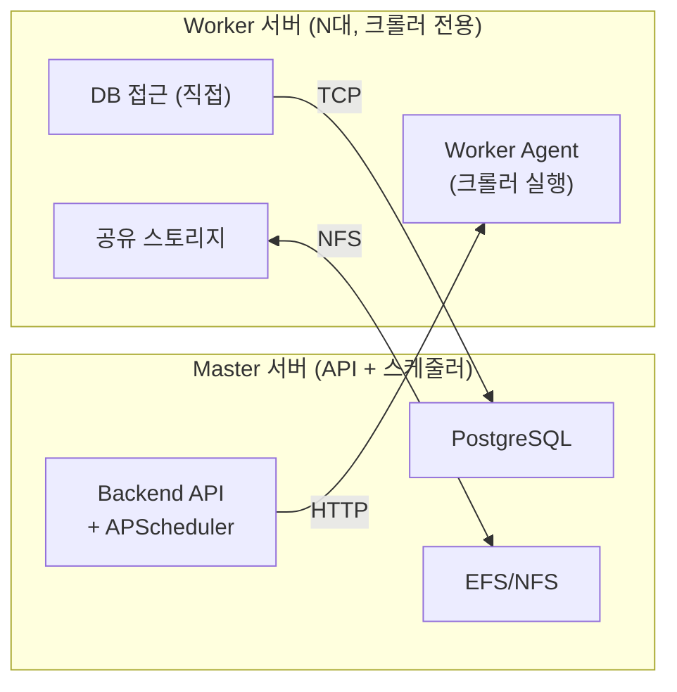
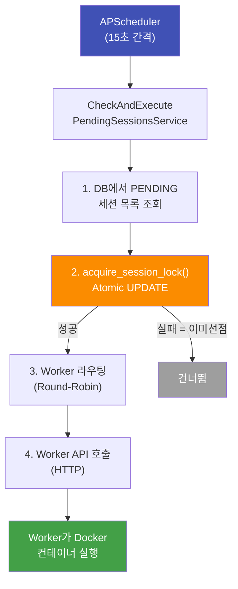

# 방안 B: Worker 서버 분리 (⭐ 권장)

> Master/Worker 역할 분리로 수평 확장 가능한 구조

---

## 핵심 개념

현재는 **"사장 + 직원"이 한 사무실에서 모든 일을 같이 하는** 구조:

```
[현재: 1대가 다 함]
사장(스케줄러): "5시에 크롤링 해야지!" → 직접 크롤러도 실행
                                     → 직접 API 응답도 처리
                                     → 직접 DB 관리도 수행
```

**방안 B**는 역할을 분리:

```
[방안 B: 역할 분리]
Master 서버(사장): "5시다! → Worker야 이거 해!"
    ↓ HTTP 호출
Worker 서버(직원): "네! 크롤러 돌리겠습니다" → Docker 컨테이너 실행
```

- **Master(사장)**: 스케줄 관리 + API 응답만 담당 (크롤러 직접 안 돌림)
- **Worker(직원)**: 크롤러만 전담 실행 (스케줄러 없음)
- **사장이 1명**이므로 → 배치 선점 문제가 **발생하지 않음** ✅

---

## 아키텍처



| | 내용 |
|---|---|
| ✅ 장점 | 수평 확장 가능, Master 장애 시에도 실행 중인 크롤링은 계속 |
| ❌ 단점 | 코드 변경 필요, 공유 스토리지 비용 |

---

## 필요한 인프라 변경

| 항목 | 현재 | 변경 후 |
|---|---|---|
| **EC2** | 1대 (All-in-One) | Master 1대 + Worker N대 |
| **스토리지** | 호스트 로컬 디스크 | **AWS EFS** (NFS 공유 볼륨) |
| **DB** | Docker Compose 내 PostgreSQL | **기존 유지** (Worker에서 TCP 접속) |
| **네트워크** | 단일 호스트 | **VPC 내 Private Subnet** |

---

## 코드 변경 사항

### 변경 1: 세션 선점 락 추가

```python
# crawling_session_repository_adapter.py — 새 메서드 추가
async def acquire_session_lock(self, session_id: UUID, worker_id: str) -> bool:
    """
    PENDING 세션을 Atomic하게 선점 (SELECT FOR UPDATE SKIP LOCKED)
    """
    stmt = (
        update(CrawlingSessionModel)
        .where(
            and_(
                CrawlingSessionModel.id == str(session_id),
                CrawlingSessionModel.status == CrawlingStatus.PENDING.value
            )
        )
        .values(
            status=CrawlingStatus.RUNNING.value,
            process_identifier=worker_id,
            updated_at=datetime.utcnow()
        )
    )
    result = await self.db.execute(stmt)
    await self.db.commit()
    return result.rowcount > 0
```

### 변경 2: CrawlingExecutorAdapter — Worker 라우팅

```python
# crawling_executor_adapter.py 수정
class CrawlingExecutorAdapter(CrawlingExecutorPort):
    async def execute_crawling(self, job_id: UUID, pending_session_id: str = None):
        # 기존: localhost:6767 호출
        # 변경: Worker 풀에서 가용 Worker 선택 후 호출
        worker_url = await self._select_available_worker()
        url = f"http://{worker_url}/api/v1/jobs/{str(job_id)}/execute"
        ...
```

### 변경 3: Worker Agent 서비스 (신규)

Worker EC2에서 실행되는 경량 FastAPI 서버:

- 크롤링 실행 API만 제공 (`/api/v1/jobs/{id}/execute`)
- 스케줄러 **없음** (Master만 스케줄러 보유)
- DB 직접 접속 (세션 상태 업데이트)
- Docker 소켓으로 크롤러 컨테이너 실행

### 변경 4: Docker Compose 분리

```yaml
# docker-compose.master.yml — Master 전용
services:
  backend:
    environment:
      ROLE: master        # 스케줄러 활성화
      WORKER_URLS: "worker1:6767,worker2:6767"

# docker-compose.worker.yml — Worker 전용
services:
  worker:
    environment:
      ROLE: worker        # 스케줄러 비활성화
      DATABASE_URL: postgresql+asyncpg://...@master-ip:5432/...
    volumes:
      - /efs/system_storage:/app/system_storage
      - /var/run/docker.sock:/var/run/docker.sock
```

---

## 세션 실행 흐름 (변경 후)



## 중복 방지 계층

| 계층 | 메커니즘 | 방어 대상 |
|---|---|---|
| **L1: 세션 선점** | `acquire_session_lock()` Atomic UPDATE | 동일 세션 중복 실행 |
| **L2: Job 락** | `acquire_lock()` (기존) | 동일 Job 중복 실행 |
| **L3: 동시 실행 제한** | `max_concurrent_jobs` DB 카운트 | 전체 시스템 과부하 |
| **L4: Job당 1세션** | RUNNING 세션 체크 (기존) | Job 내 세션 중복 |

## Worker 장애 대응

| 상황 | 감지 | 처리 |
|---|---|---|
| Worker API 응답 없음 | Master HTTP 타임아웃 (10초) | 다른 Worker로 재시도 |
| Worker 크래시 (세션 실행 중) | `sync_job_status_runner` (30초) | DB에서 RUNNING인데 컨테이너 없음 → FAILED |
| Worker 디스크 풀 | Worker 헬스체크 실패 | 풀에서 제외, EFS이므로 Master에서도 데이터 접근 가능 |
