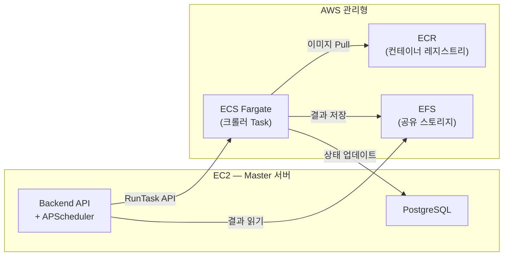

# 방안 C: AWS ECS Fargate (컨테이너 오케스트레이션)

> 크롤러 컨테이너를 EC2 직접 실행 대신 ECS Fargate에서 관리형 배치 실행

---

## 핵심 아이디어

현재 크롤링 실행 흐름은 이미 **배치 Job 패턴**:

```
[현재]
Backend → docker run --rm crawler-image → 결과 수집 → 컨테이너 삭제
```

Docker 소켓을 직접 다루는 대신, **AWS ECS RunTask API**로 교체:

```
[방안 C]  
Backend → ecs.run_task() → Fargate가 컨테이너 실행 → EFS로 결과 공유
```

---

## 아키텍처



---

## 방안 B(Worker 분리)와 비교

| 항목 | 방안 B: Worker 분리 | 방안 C: ECS Fargate |
|---|---|---|
| **Worker 관리** | EC2 직접 운영 | AWS 관리형 (서버리스) |
| **스케일링** | EC2 추가 → 수동 | Task 수 조정 → 자동 |
| **비용 모델** | EC2 상시 과금 | 실행 시간만 과금 |
| **서버 패치/보안** | 직접 관리 | AWS 관리 |
| **코드 변경** | Worker Agent 신규 개발 | Adapter 교체만 |
| **복잡도** | 중간 | 낮음 (인프라 코드만) |
| **Docker 소켓** | Worker에서 직접 사용 | 불필요 (Fargate가 관리) |
| **네트워크 제어** | VPC + SG | VPC + SG + NAT GW |

!!! tip "방안 B vs C 핵심 차이"
    방안 B는 Worker EC2를 직접 운영하면서 Docker 소켓으로 크롤러를 실행.  
    방안 C는 AWS가 컨테이너 실행을 대신 관리해주므로, **서버 운영 부담이 거의 없음**.

---

## 필요한 AWS 리소스

| 리소스 | 용도 | 비고 |
|---|---|---|
| **ECR** | 크롤러 Docker 이미지 저장 | 이미지 push/pull |
| **ECS Cluster** | Fargate Task 실행 환경 | 클러스터만 생성, 서버 없음 |
| **ECS Task Definition** | 크롤러 컨테이너 스펙 | CPU/메모리, 환경변수, EFS 마운트 |
| **EFS** | 공유 스토리지 | `system_storage/` 대체 |
| **NAT Gateway** | Fargate → 외부 인터넷 접근 | 크롤링 대상 사이트 접근용 |
| **VPC Private Subnet** | Fargate Task 네트워크 | 보안 |

### 비용 추정 (월간)

| 항목 | 스펙 | 단가 | 월 예상 |
|---|---|---|---|
| Fargate vCPU | 1 vCPU × 세션 | $0.04048/시간 | 세션 시간에 비례 |
| Fargate 메모리 | 2GB × 세션 | $0.004445/GB/시간 | 세션 시간에 비례 |
| EFS | 사용량 | $0.30/GB/월 | 50GB ≈ $15 |
| NAT Gateway | 트래픽 | $0.045/GB | 트래픽에 따라 |

!!! example "비용 예시"
    하루 20개 세션 × 평균 5분 = 100분/일 ≈ 50시간/월  
    Fargate: 50시간 × ($0.04048 + 2 × $0.004445) ≈ **$2.5/월**  
    EFS + NAT: 약 **$50/월**  
    **총 약 $50~60/월** (EC2 Worker 상시 운영 대비 저렴)

---

## 코드 변경 사항

### 핵심: `DockerCrawlerAdapter` → `EcsCrawlerAdapter` 교체

헥사고날 아키텍처 덕분에 **Adapter만 교체**하면 비즈니스 로직은 변경 없음.

```python
# 현재: DockerCrawlerAdapter (docker_crawler_adapter.py)
class DockerCrawlerAdapter(CrawlerOutputPort):
    async def execute_crawling(self, ...):
        # docker run --rm -v ... crawler-image
        subprocess.run(["docker", "run", ...])
        # 로컬 파일시스템에서 결과 수집

# 변경: EcsCrawlerAdapter (신규)
class EcsCrawlerAdapter(CrawlerOutputPort):
    async def execute_crawling(self, ...):
        # 1. ECR에서 이미지 확인 (없으면 build + push)
        image_uri = await self._ensure_image(script_path)
        
        # 2. ECS RunTask 호출
        response = self.ecs_client.run_task(
            cluster="vibe-crawler",
            taskDefinition="crawler-task",
            launchType="FARGATE",
            overrides={
                "containerOverrides": [{
                    "name": "crawler",
                    "environment": [
                        {"name": "SESSION_ID", "value": str(session_id)},
                        {"name": "SDATE", "value": sdate},
                        {"name": "EDATE", "value": edate},
                        # ... 기존 환경변수 동일
                    ],
                    "image": image_uri,
                }]
            },
            networkConfiguration={
                "awsvpcConfiguration": {
                    "subnets": ["subnet-xxx"],
                    "securityGroups": ["sg-xxx"],
                    "assignPublicIp": "DISABLED"  # NAT GW 사용
                }
            }
        )
        
        # 3. Task 완료 대기
        task_arn = response["tasks"][0]["taskArn"]
        await self._wait_for_task(task_arn)
        
        # 4. EFS에서 결과 수집 (경로는 동일)
        result = self._collect_results(session_dir)
```

### DI 설정 변경

```python
# shared/config/di.py
if settings.CRAWLER_MODE == "ecs":
    container.register(CrawlerOutputPort, EcsCrawlerAdapter)
elif settings.CRAWLER_MODE == "docker":
    container.register(CrawlerOutputPort, DockerCrawlerAdapter)
```

### 이미지 빌드 전략

| 방식 | 장점 | 단점 |
|---|---|---|
| **사전 빌드** (권장) | RunTask가 빠름 | 스크립트 변경 시 재빌드 필요 |
| **런타임 빌드** | 현재와 동일한 유연성 | CodeBuild 비용 추가 |

!!! success "권장: 사전 빌드"
    스크립트 업로드/수정 시 ECR에 이미지 push → RunTask에서 pull.  
    현재 `docker build` 로직을 업로드 시점으로 옮기면 됨.

---

## EKS 옵션

ECS Fargate 대신 EKS(Kubernetes)도 가능하지만, 이 규모에서는 오버 엔지니어링:

| | ECS Fargate | EKS |
|---|---|---|
| 관리 복잡도 | 낮음 | 높음 (kubectl, Helm 등) |
| 비용 | Task당 과금만 | 클러스터 관리비 $72/월 + 노드 비용 |
| 적합 규모 | 세션 수십 개/일 | 세션 수천 개/일 |
| 학습 곡선 | AWS 콘솔에서 가능 | K8s 지식 필요 |

!!! warning "EKS는 세션이 수천 개/일 수준이 되었을 때 고려"
    현재 20+개/일 수준에서는 ECS Fargate가 가장 합리적.

---

## 구현 단계

| Phase | 작업 | 기간 |
|---|---|---|
| 1 | EFS 생성 + EC2에서 마운트 테스트 | 1일 |
| 2 | ECR 생성 + 크롤러 이미지 push 파이프라인 | 1일 |
| 3 | ECS Cluster + Task Definition 생성 | 1일 |
| 4 | `EcsCrawlerAdapter` 개발 + 로컬 테스트 | 2~3일 |
| 5 | 스테이징 환경에서 통합 테스트 | 1~2일 |
| 6 | 운영 배포 (Docker → ECS 전환) | 1일 |
| **합계** | | **약 1~2주** |

---

## 전환 전략

!!! tip "점진적 전환 권장"
    환경변수 `CRAWLER_MODE`로 Docker/ECS 전환 가능.  
    처음에는 특정 프로젝트만 ECS로 실행하고, 안정화 후 전체 전환.

```
Phase 1: Scale-Up (즉시) → 현재 서버 디스크/메모리 증량
Phase 2: EFS 도입 → 스토리지 공유 기반 마련
Phase 3: ECS 전환 → 크롤러 실행을 Fargate로 이관
```
