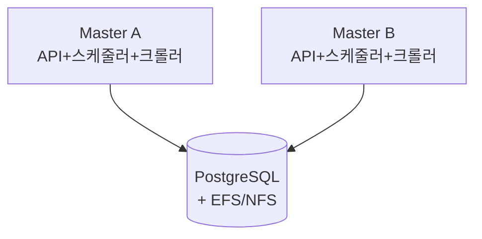

# 방안 C: 멀티 Master (Active-Active)

> 두 서버가 모두 스케줄러 + 크롤러 역할 — 배치 선점 문제 해결 필수

---

## 개요

방안 B와 달리 **두 서버가 둘 다 "사장" 역할**을 합니다:

```
[방안 C: 둘 다 사장]
서버A(사장): "5시다! 크롤링 하자!"  ──┐
                                    ├── 같은 일을 동시에 하려고 함!
서버B(사장): "5시다! 크롤링 하자!"  ──┘
```



| | 내용 |
|---|---|
| ✅ 장점 | 고가용성(HA), 부하 분산 |
| ❌ 단점 | 배치 선점 문제 해결이 **필수**, 코드 변경 범위 큼 |

---

## 배치 선점 문제 상세

### 문제 정의

**배치 선점 문제란?**  
서버가 2대 이상일 때, 각 서버가 "내가 이 일을 하겠다!"고 **동시에 손을 들어서** 같은 작업을 중복 실행하는 문제.

```
[1대일 때 — 문제 없음]
사장 1명: "대기열에 3건 있네? 1번부터 순서대로 처리하자"
→ 경쟁자가 없으니 중복 실행 불가능

[2대일 때 — 문제 발생!]
사장A: "대기열에 3건 있네! 1번 내가 한다!" ──┐
                                           ├── 1번을 둘 다 처리해버림!
사장B: "대기열에 3건 있네! 1번 내가 한다!" ──┘
```

### 현재 방어선과 한계

| 방어선 | 위치 | 효과 |
|---|---|---|
| `acquire_lock()` | `job_repository_adapter.py:346` | Job 레벨 Atomic UPDATE → **같은 Job 중복 방지** ✅ |
| `Job당 1개 세션 제한` | `check_and_execute_pending_sessions_service.py:66-73` | RUNNING 세션 있으면 스킵 ✅ |
| `max_concurrent 카운트` | DB `count_running_jobs()` | 전체 시스템 동시 실행 제한 ✅ |
| **PENDING→RUNNING 세션 전이** | API를 통해 처리 | **localhost 호출이라 자기 서버에서만 실행** ❌ |

### 핵심: 세션 선점 경쟁 (Race Condition)

```python
# check_and_execute_pending_sessions_service.py 현재 로직

# ① 15초마다 실행 — 서버A, B 모두 같은 PENDING 목록을 봄
pending_sessions = await session_repo.find_pending_sessions_oldest_per_job(limit=available_slots)

# ② for문으로 하나씩 실행 — 서버A가 세션-1을 잡으려는 순간 B도 잡으려 함
for session in pending_sessions:
    await crawling_executor.execute_crawling(session.job_id, pending_session_id=str(session.id))

# ③ 결과: 같은 세션인데 크롤러 컨테이너가 2개 뜸! 💥
```

### 해결: "먼저 손 든 사람이 가져감" (Atomic UPDATE)

DB의 Atomic UPDATE를 사용하면 **동시에 손을 들어도 딱 1명만 성공**:

```sql
-- 서버A가 먼저 이 쿼리를 실행하면:
UPDATE sessions SET status='RUNNING', worker='서버A'
WHERE id='세션-1' AND status='PENDING'
-- → rowcount=1 (성공! 세션-1은 서버A가 선점)

-- 서버B가 직후에 동일한 쿼리를 실행하면:
UPDATE sessions SET status='RUNNING', worker='서버B'
WHERE id='세션-1' AND status='PENDING'
-- → rowcount=0 (이미 RUNNING이라 WHERE 조건 불일치 → 실패, 건너뜀)
```

이 패턴은 이미 프로젝트에서 `acquire_lock()`(Job 레벨)으로 사용 중이며,
이것을 **세션 레벨에도 동일하게 적용**하는 것이 `acquire_session_lock()` 입니다.
