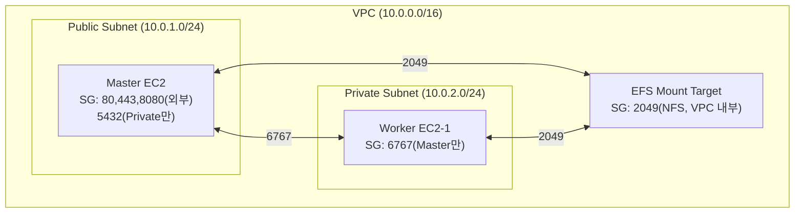

# AWS 인프라 및 실행 계획

> 리소스 구성, 네트워크 설계, 단계별 실행 계획

---

## AWS 리소스

| 리소스 | 스펙 | 용도 | 예상 월 비용 |
|---|---|---|---|
| **Master EC2** | t3.medium (2vCPU, 4GB) | API + 스케줄러 + DB | 기존 유지 |
| **Worker EC2 × 1** | t3.large (2vCPU, 8GB) | 크롤러 실행 전용 | ~$60 |
| **AWS EFS** | General Purpose | 공유 스토리지 | ~$30/100GB |
| **VPC/SG** | Private Subnet | 내부 통신 | 무료 |

## 디스크 용량 해결

| 항목 | 현재 | EFS 전환 후 |
|---|---|---|
| 용량 제한 | 96GB (EBS 고정) | **무제한** (사용량 기반 과금) |
| 서버 간 공유 | ❌ 불가 | ✅ NFS 마운트 |
| 자동 백업 | 수동 | EFS Lifecycle 정책 |
| 비용 | EBS $10/100GB | EFS $30/100GB (IA 클래스: $2.5/100GB) |

## 네트워크 구성

---

## 단계별 실행 계획

### Phase 1: 준비 (코드 변경 없이 즉시 가능)

- [ ] Master EC2 인스턴스 스케일업 (t3.medium → t3.large)
- [ ] EBS 디스크 증량 (96GB → 200GB)
- [ ] `max_concurrent_jobs` 조정 (3 → 5)
- [ ] 소요: **1일**, 코드 변경 없음

### Phase 2: 공유 스토리지 전환

- [ ] AWS EFS 생성 + Master에 마운트
- [ ] 기존 system_storage 데이터 EFS로 마이그레이션
- [ ] Docker Compose `volumes` EFS 경로로 변경
- [ ] 소요: **2~3일**

### Phase 3: 세션 선점 락 구현

- [ ] `acquire_session_lock()` 메서드 구현
- [ ] `CheckAndExecutePendingSessionsService`에 선점 로직 적용
- [ ] 유닛테스트 작성 (경쟁 조건 시뮬레이션)
- [ ] 소요: **2~3일**

### Phase 4: Worker 서버 배포

- [ ] Worker EC2 프로비저닝 (Private Subnet)
- [ ] Worker Agent 서비스 구현 (크롤링 실행 API만)
- [ ] `CrawlingExecutorAdapter` Worker 라우팅 로직
- [ ] Master↔Worker 통신 테스트
- [ ] 소요: **3~5일**

### Phase 5: 운영 전환 및 검증

- [ ] 스테이징 환경에서 멀티 서버 통합 테스트
- [ ] 배치 선점 경합 테스트 (동시 다발 PENDING 생성)
- [ ] Worker 장애 시뮬레이션 (kill 후 복구 확인)
- [ ] 운영 환경 롤아웃
- [ ] 소요: **2~3일**

---

## 리스크 및 고려사항

| 리스크 | 영향 | 완화 방안 |
|---|---|---|
| EFS 네트워크 레이턴시 | 대용량 스크린샷 저장 속도 저하 | EFS Provisioned Throughput 또는 세션별 로컬 캐시 후 비동기 동기화 |
| Worker 장애 시 세션 유실 | RUNNING 세션이 FAILED로 전환되지 않을 수 있음 | 기존 `sync_job_status_runner`로 감지 (30초 주기) |
| RDS 비용 증가 | 외부 DB 사용 시 월 $15~50 추가 | 초기에는 Master의 PostgreSQL Docker를 Worker에서 TCP 접속으로 공유 |
| 보안 | Worker가 Master DB에 직접 접속 | VPC Security Group으로 Worker IP만 허용 |
