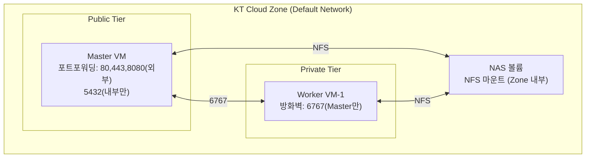

# KT Cloud 인프라 및 실행 계획

> AWS 대신 KT Cloud(G1/G2) 환경에서 Worker 분리 구성 시 참고

---

## KT Cloud 리소스

| 리소스 | 스펙 | 용도 | 예상 월 비용 |
|---|---|---|---|
| **Master VM** | m2.large (2vCPU, 4GB) | API + 스케줄러 + DB | 기존 유지 |
| **Worker VM × 1** | m2.xlarge (4vCPU, 8GB) | 크롤러 실행 전용 | ~₩70,000 |
| **NAS (NFS)** | Standard | 공유 스토리지 | ~₩30,000/100GB |
| **방화벽 정책** | Zone 내부 통신 | 서버 간 통신 | 무료 |

> KT Cloud는 G1(Classic) / G2(Enterprise) 존에 따라 콘솔 및 서비스명이 다릅니다.

---

## 디스크 용량 해결

| 항목 | 현재 | NAS 전환 후 |
|---|---|---|
| 용량 제한 | 100GB (Block Storage 고정) | **최대 10TB** (NAS 볼륨) |
| 서버 간 공유 | ❌ 불가 | ✅ NFS 마운트 |
| 자동 백업 | 수동 | NAS 스냅샷 기능 |
| 비용 | Block Storage ₩10,000/100GB | NAS ₩30,000/100GB |

---

## 네트워크 구성

### AWS vs KT Cloud 네트워크 매핑

| AWS | KT Cloud | 비고 |
|---|---|---|
| VPC | Zone (Default Network) | KT Cloud는 Zone 단위로 네트워크 격리 |
| Public Subnet | Public Tier + 포트포워딩 | 공인 IP는 포트포워딩으로 연결 |
| Private Subnet | Private Tier | 내부 IP만 사용 |
| Security Group | 방화벽 정책 | 콘솔에서 포트별 인/아웃바운드 설정 |
| EFS | NAS (NFS) | KT Cloud NAS 서비스 사용 |
| EBS | Block Storage | 가상서버에 추가 디스크 연결 |

## 리스크 및 고려사항

| 리스크 | 영향 | 완화 방안 |
|---|---|---|
| NAS 네트워크 레이턴시 | 대용량 스크린샷 저장 속도 저하 | NAS를 동일 Zone에 구성, 로컬 캐시 후 비동기 동기화 |
| Worker 장애 시 세션 유실 | RUNNING 세션이 FAILED로 전환되지 않을 수 있음 | 기존 `sync_job_status_runner`로 감지 (30초 주기) |
| DB 접근 | Worker → Master PostgreSQL TCP 접속 필요 | 방화벽 정책으로 Worker IP만 5432 허용 |
| KT Cloud 콘솔 제약 | CLI/API 자동화 제한적 | 수동 프로비저닝 후 Ansible/SSH 기반 배포 스크립트 구성 |
| NAS 용량 한계 | 최대 10TB (AWS EFS 대비 제한) | 보관 기간 관리 + 자동 정리로 대응 |
