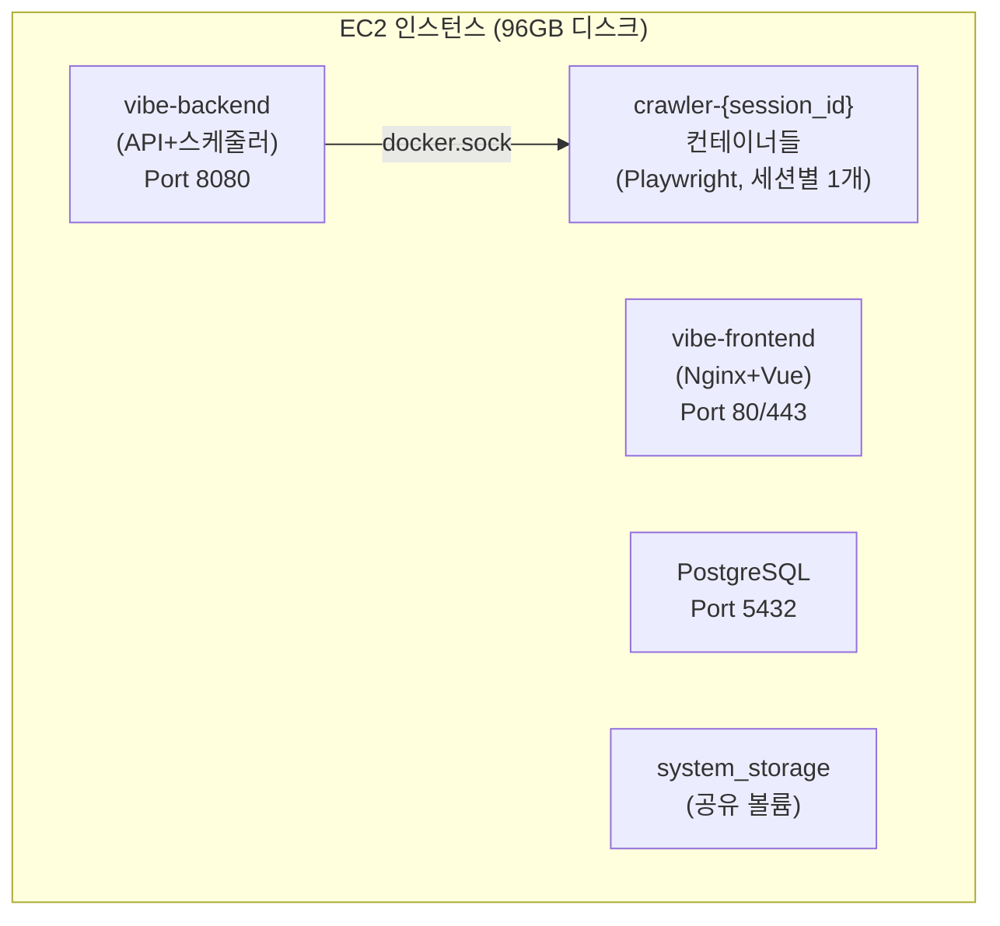

# 크롤링 서버 증량 계획서

> 작성일: 2026-03-18 KST  
> 대상: 운영(Prod) 환경  
> 목적: 크롤링 처리 용량 확장 및 배치 선점 문제 해결

---

## 현재 아키텍처 (단일 EC2)

### 현재 배치 동작 방식

| 구성 요소 | 현재 방식 | 문제점 |
|---|---|---|
| **스케줄러** | APScheduler (인메모리, 단일 프로세스) | 서버 2대 이상이면 **중복 실행** 발생 |
| **PENDING 세션 픽업** | 15초 간격 폴링 → `localhost:6767` API 호출 | 자기 자신만 호출 가능, **타 서버로 분배 불가** |
| **동시 실행 제한** | `max_concurrent_jobs` (DB 기반 카운트) | DB 레벨 카운트는 공유 가능하나, **슬롯 선점 경합** 있음 |
| **Job 락** | `acquire_lock()` — SQL UPDATE WHERE status≠RUNNING | **DB 레벨 Atomic**이므로 멀티서버에서도 안전 ✅ |
| **크롤러 실행** | Docker 형제 컨테이너 (`docker.sock` 마운트) | 해당 호스트의 Docker만 제어 가능 |
| **스토리지** | `/app/system_storage` (호스트 디렉토리 마운트) | **각 서버 로컬 디스크에 저장**, 서버 간 공유 안 됨 |

### 현재 병목 지점

| 병목 | 현재 수치 | 영향 |
|---|---|---|
| 동시 크롤링 수 | `max_concurrent_jobs = 3` | 프로젝트 20+개 시 대기 시간 증가 |
| 디스크 | 96GB (일당 4~16GB 소모) | 보관 기간 10일 이상 불가 |
| CPU/메모리 | Playwright + Chromium 세션당 1~2GB RAM | 동시 3개 = 최소 6GB RAM 필요 |

---

## 방안 비교

| 방안 | 방식 | 코드 변경 | 확장성 | 비용 | 권장 환경 |
|---|---|---|---|---|---|
| [**A: Scale-Up**](01-scale-up.md) | 인스턴스/디스크 증량 | 없음 | 제한적 | 고정비 증가 | 즉시 적용 |
| [**B: Worker 분리**](02-worker-separation.md) | Master/Worker 역할 분리 | Worker Agent 개발 | ✅ 수평 확장 | EC2 상시 비용 | KT Cloud |
| [**C: ECS Fargate**](03-ecs-fargate.md) | AWS 관리형 컨테이너 | Adapter 교체 | ✅ 자동 확장 | 실행 시간만 과금 | **⭐ AWS** |

!!! success "환경별 권장"
    - **KT Cloud**: 방안 B (Worker 분리) — VM 직접 운영
    - **AWS**: 방안 C (ECS Fargate) — 서버리스, Adapter 교체만으로 전환 가능

### 세부 문서

- [방안 A: Scale-Up](01-scale-up.md) — 즉시 적용 가능한 스케일업
- [방안 B: Worker 분리](02-worker-separation.md) — Master/Worker 역할 분리 설계
- [방안 C: ECS Fargate](03-ecs-fargate.md) — AWS 관리형 컨테이너 오케스트레이션
- [AWS 인프라 및 실행 계획](04-infra-and-plan.md) — AWS 기준 리소스, 네트워크, 단계별 계획
- [KT Cloud 인프라 및 실행 계획](05-infra-ktcloud.md) — KT Cloud 기준 리소스, NAS, 방화벽
