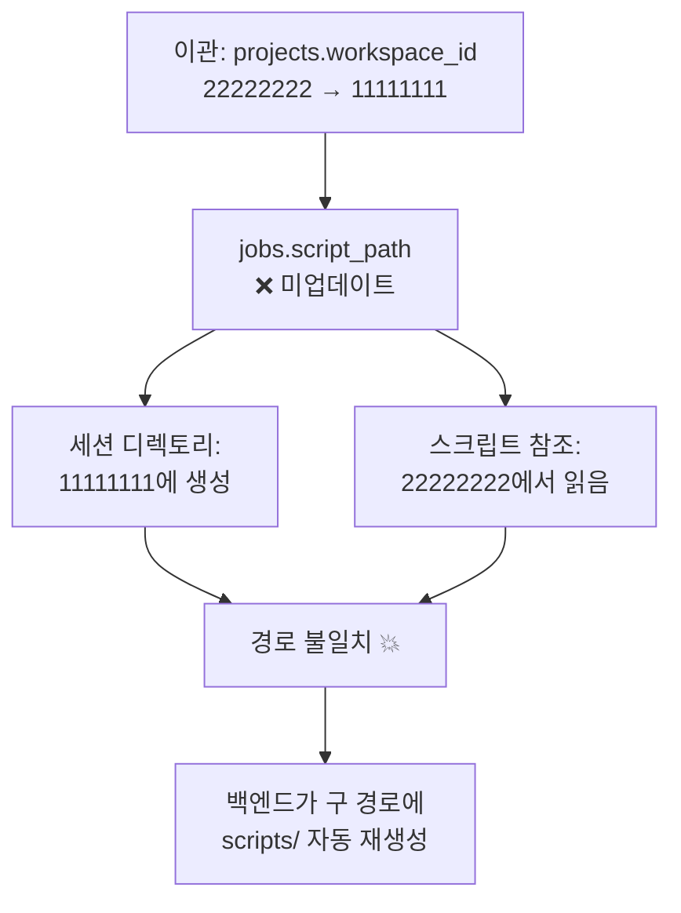

# 프로젝트 이관 계획서: MINDK → INCRO

> 작성일: 2026-03-17 KST
> 상태: ✅ **이관 완료** (2026-03-17 14:30 KST)

---

## 1. 개요

마인드노크(MINDK) 워크스페이스의 인크로스 관련 프로젝트 8개를 인크로스(INCRO) 워크스페이스로 이관.
프로젝트명의 코드네이밍도 `MINDK` → `INCRO`로 변경.

---

## 2. 워크스페이스 정보

| 항목 | 마인드노크 (출발) | 인크로스 (도착) |
|---|---|---|
| ID | `22222222-2222-2222-2222-222222222222` | `11111111-1111-1111-1111-111111111111` |
| code | `MINDK` | `INCRO` |
| 파일 경로 | `system_storage/workspaces/22222222-.../projects/` | `system_storage/workspaces/11111111-.../projects/` |

---

## 3. 이관 대상 프로젝트 (8개)

| # | 현재 프로젝트명 | 변경 후 프로젝트명 | Project ID (UUID) |
|---|---|---|---|
| 1 | MINDK_티빙_20260128_DB15A155101A | INCRO_티빙_20260128_DB15A155101A | `9ea1c9b0-f2f7-4138-b5bd-db15a155101a` |
| 2 | MINDK_OCB_20260202_Y3YCVP2G | INCRO_OCB_20260202_Y3YCVP2G | `fa7aaf1d-3f1e-4d91-aade-8d7f8ac92c42` |
| 3 | MINDK_리니지W_모비온_20251216_068A5BED4CF8 | INCRO_리니지W_모비온_20251216_068A5BED4CF8 | `89e5483e-5850-461b-a43d-068a5bed4cf8` |
| 4 | MINDK_리니지W_인벤_20251216_6D74E5EAAEF3 | INCRO_리니지W_인벤_20251216_6D74E5EAAEF3 | `f7cad62f-f289-4461-a4cc-6d74e5eaaef3` |
| 5 | MINDK_리니지W_인터웍스_20251216_487F5A6F4628 | INCRO_리니지W_인터웍스_20251216_487F5A6F4628 | `37703364-be4a-4f76-b568-487f5a6f4628` |
| 6 | MINDK_리니지W_에이스트레이더_20251216_B127C4A79AD7 | INCRO_리니지W_에이스트레이더_20251216_B127C4A79AD7 | `c9dd694a-fd56-4abf-9dc1-b127c4a79ad7` |
| 7 | MINDK_코비(소재)_20260130_7A4510C762C3 | INCRO_코비(소재)_20260130_7A4510C762C3 | `470f8afa-9bf2-465f-9193-0f595e3b05e4` |
| 8 | MINDK_코비(캠페인)_20260130_7A4510C762C3 | INCRO_코비(캠페인)_20260130_7A4510C762C3 | `7803af8a-2061-4b34-8948-7a4510c762c3` |

> ℹ️ 7번(소재)과 8번(캠페인)은 이름 끝 코드는 같지만 **UUID는 다릅니다** (별도 프로젝트)

### 이관 비대상 (마인드노크에 남는 프로젝트)

| 프로젝트명 | Project ID |
|---|---|
| MINDK_SK_데이터수집_그룹하위탭_20260205_CQUCEJAU | `3c042a40-b79d-49e0-b99c-9db5705e6825` |
| MINDK_리니지W_다윈_20251216_4684EF1E311F | `18e9b8d6-600f-4148-ace6-4684ef1e311f` |
| MINDK_버거킹_네이버GFA_20260112_89C777783F81 | `e0b0a404-cf47-4fd0-921f-89c777783f81` |
| MINDK_애드팝콘_20260204_CU4UJUS9 | `14143f81-3d91-4ed0-8386-3a5aea9e9535` |

---

## 4. 이관 작업 상세

### 4-1. DB 업데이트 (SQL)

```sql
-- 1) projects 테이블: workspace_id 변경 + 프로젝트명 MINDK → INCRO
UPDATE projects
SET workspace_id = '11111111-1111-1111-1111-111111111111',
    name = REPLACE(name, 'MINDK_', 'INCRO_'),
    updated_at = NOW()
WHERE id IN (
    '9ea1c9b0-f2f7-4138-b5bd-db15a155101a',  -- 티빙
    'fa7aaf1d-3f1e-4d91-aade-8d7f8ac92c42',  -- OCB
    '89e5483e-5850-461b-a43d-068a5bed4cf8',  -- 리니지W_모비온
    'f7cad62f-f289-4461-a4cc-6d74e5eaaef3',  -- 리니지W_인벤
    '37703364-be4a-4f76-b568-487f5a6f4628',  -- 리니지W_인터웍스
    'c9dd694a-fd56-4abf-9dc1-b127c4a79ad7',  -- 리니지W_에이스트레이더
    '470f8afa-9bf2-465f-9193-0f595e3b05e4',  -- 코비(소재)
    '7803af8a-2061-4b34-8948-7a4510c762c3'   -- 코비(캠페인)
);

-- 2) 연관 테이블 확인 (FK cascade 여부)
-- jobs, crawling_sessions 등은 project_id FK로 연결되어 있으므로
-- workspace_id 변경만으로 자동 반영됨 (별도 수정 불필요)
```

### 4-2. 파일시스템 이관 (운영서버)

프로젝트별 디렉토리를 마인드노크 → 인크로스 워크스페이스로 이동.

```bash
SRC=~/vibe-deployment/system_storage/workspaces/22222222-2222-2222-2222-222222222222/projects
DST=~/vibe-deployment/system_storage/workspaces/11111111-1111-1111-1111-111111111111/projects

# 이관 대상 8개 프로젝트 디렉토리 이동
for pid in \
  9ea1c9b0-f2f7-4138-b5bd-db15a155101a \
  fa7aaf1d-3f1e-4d91-aade-8d7f8ac92c42 \
  89e5483e-5850-461b-a43d-068a5bed4cf8 \
  f7cad62f-f289-4461-a4cc-6d74e5eaaef3 \
  37703364-be4a-4f76-b568-487f5a6f4628 \
  c9dd694a-fd56-4abf-9dc1-b127c4a79ad7 \
  470f8afa-9bf2-465f-9193-0f595e3b05e4 \
  7803af8a-2061-4b34-8948-7a4510c762c3; do
    echo "Moving $pid..."
    mv "$SRC/$pid" "$DST/$pid"
done
```

#### 이동 대상 하위 폴더 구조

```
projects/<project-id>/
├── scripts/          ← 크롤링 스크립트
├── sessions/         ← 날짜별 세션 로그 (action_snapshots, videos, downloads)
├── hotfixes/         ← 핫픽스
└── mdc/              ← MDC 관련 파일
```

### 4-3. Legacy 경로 확인

`crawling_results/` (Legacy 구조)에 해당 프로젝트 데이터가 있는지도 확인.
현재 운영서버에서 Legacy 경로는 비어있는 것으로 확인됨.

---

## 5. 실행 순서


| 단계 | 작업 | 비고 |
|---|---|---|
| 0 | 현재 실행 중인 세션 없는지 확인 | `docker ps --filter name=crawler-` |
| 1 | DB 백업 (`pg_dump`) | 롤백용 |
| 2 | DB UPDATE 실행 (workspace_id, name) | 트랜잭션 내 실행 |
| 3 | 파일시스템 `mv` 실행 | 운영서버 SSH |
| 4 | 검증 (아래 체크리스트) | |
| 5 | 문제 없으면 완료 처리 | |

---

## 6. 사전 확인 (DB 조회)

아래 SQL로 이관 대상 프로젝트의 실제 UUID를 확인:

```sql
-- 이관 대상 프로젝트 조회
SELECT id, name, workspace_id, created_at
FROM projects
WHERE workspace_id = '22222222-2222-2222-2222-222222222222'
  AND name LIKE 'MINDK_%'
ORDER BY name;

-- 카테고리도 이관 필요한지 확인
SELECT c.id, c.name, c.workspace_id
FROM categories c
JOIN projects p ON p.category_id = c.id
WHERE p.workspace_id = '22222222-2222-2222-2222-222222222222'
  AND p.name LIKE 'MINDK_%';
```

---

## 7. 검증 체크리스트

### DB 검증
- [x] `SELECT * FROM projects WHERE name LIKE 'INCRO_%'` → INCRO 워크스페이스 15개 (이관 8개 + 기존 7개)
- [x] `SELECT * FROM projects WHERE name LIKE 'MINDK_%'` → 비대상 4개만 남음 확인
- [x] 각 프로젝트의 `workspace_id`가 `11111111-...`인지 확인

### 파일시스템 검증
- [x] 인크로스 경로에 이관된 프로젝트 폴더 존재 확인
- [x] 마인드노크 경로에 이관된 프로젝트 폴더 없음 확인 (비대상 6개만 남음)

### 기능 검증
- [x] 프로젝트 목록 페이지에서 INCRO 워크스페이스에 이관된 프로젝트 표시 확인
- [x] 세션 목록 → 세션 상세 → 스냅샷/로그 조회 정상 확인
- [x] 스크립트 다운로드 정상 확인
- [x] 다운로드 파일(downloads/) 조회 정상 확인
- [x] 핫픽스 목록 조회 정상 확인

### 롤백 계획 (필요 시)
- 파일시스템 역방향 `mv` (인크로스 → 마인드노크)
- DB: `UPDATE projects SET workspace_id='22222222-...', name=REPLACE(name,'INCRO_','MINDK_') WHERE id IN (...)`

---

## 8. 검증 결과 (실행 후 기록)

- 실행 날짜/시간: **2026-03-17 14:30 KST**
- DB 업데이트 결과: **8 rows** updated
- 파일 이동 결과: **8개** 프로젝트 이동 완료 (모두 OK)
- DB 검증: ✅ 통과
- 파일시스템 검증: ✅ 통과
- 기능 검증: ✅ 통과

---

## 9. 후속 보완 작업 (2026-03-19 발견)

> ⚠️ 이관 시 누락된 항목들이 발견되어 보완 필요

### 9-1. 문제 요약



이관 작업에서 `projects` 테이블만 업데이트하고, **`jobs.script_path`는 업데이트하지 않음**.
이로 인해 이관 후에도 구 workspace(`22222222-...`) 경로를 참조하는 문제 발생.

| 항목 | 상태 | 비고 |
|---|---|---|
| `projects.workspace_id` | ✅ 업데이트됨 | `11111111-...` |
| `jobs.script_path` | ❌ **미업데이트** | 여전히 `22222222-...` 경로 |
| 세션 디렉토리 생성 | `11111111-...`에 생성 | `projects.workspace_id` 기준 |
| 스크립트 참조 | `22222222-...`에서 참조 | `jobs.script_path` 기준 |

**영향**: 백엔드가 `jobs.script_path` 기준으로 스크립트를 참조하면서, 구 경로에 `scripts/` 폴더를 **자동 재생성**함.

### 9-2. 구 workspace에 자동 생성된 잔여 파일 현황

이관 대상 프로젝트 중 구 경로(`22222222-...`)에 다시 생성된 폴더:

| Project ID | 프로젝트명 | 잔여 내용 |
|---|---|---|
| `f7cad62f` | 리니지W_인벤 | `scripts/v7.zip` (03-18 재생성) |
| `37703364` | 리니지W_인터웍스 | `scripts/` |
| `470f8afa` | 코비(소재) | `scripts/` |

> 이들은 `mv`로 이동된 후 백엔드가 `jobs.script_path` 기준으로 접근하면서 자동 생성된 것.

### 9-3. 보완 작업 상세

#### A. DB: `jobs.script_path` 업데이트

```sql
-- jobs.script_path에서 구 workspace ID → 신 workspace ID로 변경
UPDATE jobs
SET script_path = REPLACE(
    script_path,
    'workspaces/22222222-2222-2222-2222-222222222222',
    'workspaces/11111111-1111-1111-1111-111111111111'
),
    updated_at = NOW()
WHERE project_id IN (
    '9ea1c9b0-f2f7-4138-b5bd-db15a155101a',  -- 티빙
    'fa7aaf1d-3f1e-4d91-aade-8d7f8ac92c42',  -- OCB
    '89e5483e-5850-461b-a43d-068a5bed4cf8',  -- 리니지W_모비온
    'f7cad62f-f289-4461-a4cc-6d74e5eaaef3',  -- 리니지W_인벤
    '37703364-be4a-4f76-b568-487f5a6f4628',  -- 리니지W_인터웍스
    'c9dd694a-fd56-4abf-9dc1-b127c4a79ad7',  -- 리니지W_에이스트레이더
    '470f8afa-9bf2-465f-9193-0f595e3b05e4',  -- 코비(소재)
    '7803af8a-2061-4b34-8948-7a4510c762c3'   -- 코비(캠페인)
)
AND script_path LIKE '%22222222-2222-2222-2222-222222222222%';
```

#### B. 파일시스템: 자동 생성된 잔여 scripts/ 삭제

```bash
# 구 workspace에서 이관 대상 프로젝트의 자동 생성된 scripts/ 삭제
OLD_WS=~/vibe-deployment/system_storage/workspaces/22222222-2222-2222-2222-222222222222/projects

for pid in \
  f7cad62f-f289-4461-a4cc-6d74e5eaaef3 \
  37703364-be4a-4f76-b568-487f5a6f4628 \
  470f8afa-9bf2-465f-9193-0f595e3b05e4; do
    if [ -d "$OLD_WS/$pid" ]; then
        echo "Removing leftover: $OLD_WS/$pid"
        rm -rf "$OLD_WS/$pid"
    fi
done
```

#### C. 파일시스템: 이관 후 생성된 세션 로그 이동

이관(03-17 14:30) 이후에 실행된 세션의 로그가 구 경로에 생성되었을 수 있음.
구 경로의 `sessions/` 폴더에 03-17 이후 날짜 폴더가 있으면 신 경로로 병합 이동.

```bash
OLD_WS=~/vibe-deployment/system_storage/workspaces/22222222-2222-2222-2222-222222222222/projects
NEW_WS=~/vibe-deployment/system_storage/workspaces/11111111-1111-1111-1111-111111111111/projects

# 이관 대상 8개 프로젝트에서 세션 폴더 확인 및 이동
for pid in \
  9ea1c9b0-f2f7-4138-b5bd-db15a155101a \
  fa7aaf1d-3f1e-4d91-aade-8d7f8ac92c42 \
  89e5483e-5850-461b-a43d-068a5bed4cf8 \
  f7cad62f-f289-4461-a4cc-6d74e5eaaef3 \
  37703364-be4a-4f76-b568-487f5a6f4628 \
  c9dd694a-fd56-4abf-9dc1-b127c4a79ad7 \
  470f8afa-9bf2-465f-9193-0f595e3b05e4 \
  7803af8a-2061-4b34-8948-7a4510c762c3; do

    OLD_SESSIONS="$OLD_WS/$pid/sessions"
    NEW_SESSIONS="$NEW_WS/$pid/sessions"

    if [ -d "$OLD_SESSIONS" ]; then
        echo "=== $pid ==="
        for date_dir in "$OLD_SESSIONS"/202603*; do
            date_name=$(basename "$date_dir")
            if [ -d "$NEW_SESSIONS/$date_name" ]; then
                # 이미 신 경로에 같은 날짜 폴더 존재 → 세션별로 병합
                for session_dir in "$date_dir"/*/; do
                    session_name=$(basename "$session_dir")
                    if [ ! -d "$NEW_SESSIONS/$date_name/$session_name" ]; then
                        echo "  Moving session: $date_name/$session_name"
                        mv "$session_dir" "$NEW_SESSIONS/$date_name/$session_name"
                    fi
                done
            else
                # 날짜 폴더째 이동
                echo "  Moving date folder: $date_name"
                mv "$date_dir" "$NEW_SESSIONS/$date_name"
            fi
        done
    fi
done
```

### 9-4. 보완 실행 순서

| 단계 | 작업 | 비고 |
|---|---|---|
| 0 | 실행 중 세션 없는지 확인 | `docker ps --filter name=crawler-` |
| 1 | DB: `jobs.script_path` UPDATE | 위 SQL 실행 |
| 2 | 파일시스템: 세션 로그 이동 (C) | 이관 후 생성된 세션만 |
| 3 | 파일시스템: 잔여 scripts/ 삭제 (B) | 자동 생성된 것만 |
| 4 | 검증 | 아래 체크리스트 |

### 9-5. 보완 검증 체크리스트

- [x] `SELECT script_path FROM jobs WHERE project_id IN (...)` → 모두 `11111111-...` 경로인지 확인
- [x] 구 workspace에 이관 대상 프로젝트 폴더 없음 확인
- [ ] 신 workspace에서 세션 목록 → 상세 → 스냅샷/로그 정상 조회
- [ ] 스케줄 실행 후 세션이 `11111111-...` 경로에 생성되고 `crawling_result.json` 정상 생성 확인

### 9-6. 보완 작업 실행 결과

- 실행 날짜/시간: **2026-03-19 16:25 KST**
- DB 업데이트: `UPDATE jobs SET script_path = REPLACE(...)` → **4 rows** updated
  - `470f8afa` (코비소재), `7803af8a` (코비캠페인), `37703364` (인터웍스), `f7cad62f` (인벤)
  - 나머지 4개는 레거시 경로(`/app/system_storage/projects/...`)로 workspace 미포함 → 영향 없음
- 세션 로그 이동: 구 workspace에 이관 대상 세션 없음 → **이동 불필요**
- 잔여 파일 삭제: 구 workspace에 자동 재생성된 `scripts/` 폴더 **5개** 삭제
  - `f7cad62f`, `37703364`, `470f8afa`, `fa7aaf1d`, `7803af8a`

---

## 10. 레거시 경로 전체 정리 (2026-03-19)

### 10-1. 현황

| # | 프로젝트 | workspace | 현재 script_path | 문제 |
|---|---|---|---|---|
| A | `57650074` INCRO_11번가 | INCRO(`11111111`) | `workspaces/22222222-.../v4.zip` | WS 불일치 |
| B | `fa7aaf1d` INCRO_OCB | INCRO(`11111111`) | `/app/system_storage/projects/.../restored_...` | 레거시 |
| C | `89e5483e` INCRO_리니지W_모비온 | INCRO(`11111111`) | `/app/system_storage/projects/.../modified/...` | 레거시 |
| D | `c9dd694a` INCRO_리니지W_에이스트레이더 | INCRO(`11111111`) | `/app/system_storage/projects/.../modified/...` | 레거시 |
| E | `9ea1c9b0` INCRO_티빙 | INCRO(`11111111`) | `/app/system_storage/projects/.../modified/...` | 레거시 |
| F | `18e9b8d6` MINDK_리니지W_다윈 | MINDK(`22222222`) | `/app/system_storage/projects/.../restored_...` | 레거시 (파일없음) |
| G | `e0b0a404` MINDK_버거킹_네이버GFA | MINDK(`22222222`) | `/app/system_storage/projects/.../modified/...` | 레거시 (파일없음) |

### 10-2. 작업 계획

#### A. `57650074` — 파일 이동 + DB 변경

```bash
# 파일을 22222222 → 11111111로 이동
docker exec vibe-crawler-backend bash -c "
  SRC=/app/system_storage/workspaces/22222222-2222-2222-2222-222222222222/projects/57650074-b084-40ca-9d98-8fda830a24b7
  DST=/app/system_storage/workspaces/11111111-1111-1111-1111-111111111111/projects/57650074-b084-40ca-9d98-8fda830a24b7
  mkdir -p \$DST
  cp -r \$SRC/* \$DST/
  rm -rf \$SRC
"
```

```sql
UPDATE jobs SET script_path = REPLACE(script_path,
  'workspaces/22222222-2222-2222-2222-222222222222',
  'workspaces/11111111-1111-1111-1111-111111111111'),
  updated_at = NOW()
WHERE id = 'ea546f64-...' -- 57650074의 job
AND script_path LIKE '%22222222%';
```

#### B~E. INCRO 레거시 4개 — modified/ 복사 + DB 변경

레거시 경로(`/app/system_storage/projects/{pid}/scripts/modified/`)에만 있는 파일을
workspace 경로(`/app/system_storage/workspaces/11111111-.../projects/{pid}/scripts/modified/`)로 복사.

```bash
docker exec vibe-crawler-backend bash -c "
  for pid in fa7aaf1d-3f1e-4d91-aade-8d7f8ac92c42 89e5483e-5850-461b-a43d-068a5bed4cf8 c9dd694a-fd56-4abf-9dc1-b127c4a79ad7 9ea1c9b0-f2f7-4138-b5bd-db15a155101a; do
    SRC=/app/system_storage/projects/\$pid/scripts
    DST=/app/system_storage/workspaces/11111111-1111-1111-1111-111111111111/projects/\$pid/scripts
    if [ -d \$SRC/modified ] && [ ! -d \$DST/modified ]; then
      cp -r \$SRC/modified \$DST/modified
      echo \"Copied modified/ for \$pid\"
    fi
    if [ -d \$SRC/backups ] && [ ! -d \$DST/backups ]; then
      cp -r \$SRC/backups \$DST/backups
      echo \"Copied backups/ for \$pid\"
    fi
    # restored 파일 복사
    for f in \$SRC/restored_*; do
      [ -f \"\$f\" ] && cp \"\$f\" \$DST/ && echo \"Copied \$(basename \$f) for \$pid\"
    done
  done
"
```

```sql
-- 레거시 → workspace 경로로 DB 변경
UPDATE jobs SET script_path = REPLACE(script_path,
  '/app/system_storage/projects/',
  'system_storage/workspaces/11111111-1111-1111-1111-111111111111/projects/'),
  updated_at = NOW()
WHERE project_id IN (
  'fa7aaf1d-3f1e-4d91-aade-8d7f8ac92c42',
  '89e5483e-5850-461b-a43d-068a5bed4cf8',
  'c9dd694a-fd56-4abf-9dc1-b127c4a79ad7',
  '9ea1c9b0-f2f7-4138-b5bd-db15a155101a'
) AND script_path LIKE '/app/system_storage/projects/%';
```

#### F~G. MINDK 레거시 2개 — DB만 변경

레거시 경로에 파일이 없고, workspace 경로에 이미 존재. DB만 변경.

```sql
-- F. 18e9b8d6 (다윈): 레거시 경로에 파일없음 → WS의 최신 restored 사용
UPDATE jobs SET script_path = 'system_storage/workspaces/22222222-2222-2222-2222-222222222222/projects/18e9b8d6-600f-4148-ace6-4684ef1e311f/scripts/v1.zip',
  updated_at = NOW()
WHERE id = 'e5cf6533-...' AND project_id = '18e9b8d6-600f-4148-ace6-4684ef1e311f';

-- G. e0b0a404 (버거킹): 레거시 경로에 파일없음 → WS의 v2.zip 사용
UPDATE jobs SET script_path = 'system_storage/workspaces/22222222-2222-2222-2222-222222222222/projects/e0b0a404-cf47-4fd0-921f-89c777783f81/scripts/v2.zip',
  updated_at = NOW()
WHERE id = '5c1907ae-...' AND project_id = 'e0b0a404-cf47-4fd0-921f-89c777783f81';
```

### 10-3. 검증 체크리스트

- [x] `SELECT script_path FROM jobs` → 레거시 경로(`/app/system_storage/projects/`) **0건** ✅
- [x] `SELECT script_path FROM jobs` → `22222222-...` 참조는 MINDK 비이관 프로젝트만 (SK, 다윈, 버거킹, 애드팝콘) ✅
- [x] INCRO 프로젝트 전체 `11111111-...` workspace 경로로 통일 ✅

### 10-4. 실행 결과

- 실행 날짜/시간: **2026-03-19 16:53 KST**
- A: `57650074`(11번가) 파일이동 + DB UPDATE 1
- B~E: INCRO 레거시 4개 파일복사(modified/backups/restored) + DB UPDATE 4
- F: `18e9b8d6`(다윈) DB UPDATE 1 → `v1.zip`
- G: `e0b0a404`(버거킹) DB UPDATE 1 → `v2.zip`
- 최종 확인: 전체 19개 job 중 레거시 경로 **0건**, NULL 1건(정상)
